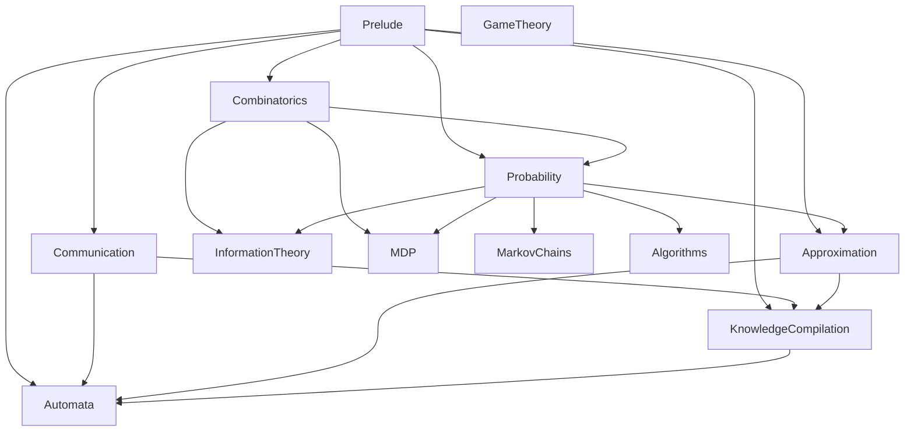

# Arlib — architecture

A curated, Mathlib-style Lean 4 library of reusable results in randomised algorithms,
knowledge compilation, Markov chains, and the probability and information theory
underneath them. Built against Lean and Mathlib `v4.33.0`.

This document explains how the library is laid out and why. It is not a tutorial and not
a result catalogue; for the actual mathematics, each area root file carries a long prose
docstring that is the authoritative description of that area. For contributor-facing
rules see [CONVENTIONS.md](CONVENTIONS.md) and [CONTRIBUTING.md](CONTRIBUTING.md); for
the papers behind the results see [REFERENCES.md](REFERENCES.md); for the `api-overhaul`
renames see [MIGRATION.md](MIGRATION.md).

---

## 1. The shape of the library

There is one root module, [Arlib.lean](Arlib.lean), which does nothing but re-export the
area roots. Each area root re-exports the modules of its area. So there are exactly three
granularities of import:

| You want | You write |
| --- | --- |
| everything | `import Arlib` |
| one area | `import Arlib.Probability` |
| one piece | `import Arlib.Probability.Chernoff` |

There are **twelve** area roots: `Prelude`, `Combinatorics`, `Communication`,
`Probability`, `InformationTheory`, `MarkovChains`, `Approximation`, `MDP`, `GameTheory`,
`Algorithms`, `KnowledgeCompilation`, `Automata`. `Prelude` is a single file of shared
notation rather than a directory; the other eleven each have a directory beside them.
The library root's docstring documents all twelve, in dependency order.

309 `.lean` files live under `Arlib/`: 297 modules, 11 area roots and `Prelude.lean`.

The table below is the map of the library: what each area contains, how large it is,
and the file to open first. It is in dependency order, matching the root docstring —
`Prelude` depends on nothing, `Automata` sits on top. Module counts exclude the area
root itself; line counts include it.

| Area | Contents | Size | Start here |
| --- | --- | --- | --- |
| Prelude | The relative-error interval `(1 ± ε)·b`, the shape every approximation guarantee in the library is stated in. | one file, ~60 lines | [Arlib/Prelude.lean](Arlib/Prelude.lean) |
| Combinatorics | Generic `Finset` / `List` / `BigOperators` lemmas that recur but are not in Mathlib under a findable name; the atoms of a finite family of sets; a sharp coupon-collector bound proved by counting. | 7 modules, ~1k lines | [Arlib/Combinatorics.lean](Arlib/Combinatorics.lean) |
| Communication | Two-party communication complexity as a measure of combinatorial structure rather than a model of computation: variable partitions, rectangles, covers and partitions of a fibre, the counting measures `Cov` and `Par`, nonnegative rank, gadget composition. It sits below both areas that use it, since a circuit lower bound and an automaton lower bound need the same rectangles. | 6 modules, ~1.9k lines | [Arlib/Communication.lean](Arlib/Communication.lean) |
| Probability | Finite probability spaces with `Finset` events and real sums; product and coin spaces; independence and k-wise independence; conditional expectation; moment and tail bounds (Markov, Chernoff, Freedman, median-of-means); Poisson laws, couplings, total variation. A smaller measure-theoretic layer covers stochastic approximation and martingale convergence, where no finite surrogate exists. | 73 modules, ~22k lines | [Arlib/Probability.lean](Arlib/Probability.lean) |
| InformationTheory | Discrete Shannon theory over a finite probability space: entropy, conditional entropy, mutual information, KL divergence, the chain rule, Gibbs, data processing, Fano, and query lower bounds. Mathlib provides none of this for discrete random variables. | 16 modules, ~3.5k lines | [Arlib/InformationTheory.lean](Arlib/InformationTheory.lean) |
| MarkovChains | Finite chains: the `L²(μ)` calculus, Dirichlet forms, spectral gap defined variationally by the Poincaré inequality (never as `1 − λ₂`), total variation and mixing time, entropy decay, spectral independence and local-to-global techniques; and worked analyses of specific chains (Glauber, Metropolis, hard-core, block dynamics, Bernoulli–Laplace). | 59 modules, ~29k lines | [Arlib/MarkovChains.lean](Arlib/MarkovChains.lean) |
| Approximation | The algebra of multiplicative error windows; FPRAS and FPAUS as predicates on a randomised algorithm, self-reducibility, parsimonious reductions, amplification; Karp–Luby; and domain reduction for `ℓ¹` linear tests — coresets, subspace embeddings, and Lewis weights with their existence and sampling theorems. | 48 modules, ~15k lines | [Arlib/Approximation.lean](Arlib/Approximation.lean) |
| MDP | Finite Markov decision processes with reachability objectives: the Bellman optimality operator, end components, the hitting-time weight and the contraction it supplies, `Q*` constructed by value iteration, trajectory semantics, policy values. | 11 modules, ~2.7k lines | [Arlib/MDP.lean](Arlib/MDP.lean) |
| GameTheory | Yao's minimax principle, in the averaging form that lower-bound arguments use. | 1 module, ~100 lines | [Arlib/GameTheory.lean](Arlib/GameTheory.lean) |
| Algorithms | Analyses of specific randomised algorithms, each split so that only the problem-independent half lives here. Currently the Tootsie Pop Algorithm: the Poisson law of its contraction counter and almost-sure termination. | 4 modules, ~850 lines | [Arlib/Algorithms.lean](Arlib/Algorithms.lean) |
| KnowledgeCompilation | Representation languages for Boolean functions (NNF and its decomposable, deterministic and structured fragments, SDD, v-trees) as DAGs; the communication-complexity measures that bound their size; size lower bounds and succinctness separations; non-deterministic read-once branching programs; compilation by forgetting; Tseitin formulas; structured probabilistic circuits. | 54 modules, ~30k lines | [Arlib/KnowledgeCompilation.lean](Arlib/KnowledgeCompilation.lean) |
| Automata | NFA, DFA and unambiguous finite automata, with runs as first-class objects; lower bounds on the number of states needed to complement, to union and to separate, obtained through communication complexity; succinct NFAs; tree automata. | 18 modules, ~8k lines | [Arlib/Automata.lean](Arlib/Automata.lean) |

Section 3 expands each row into a module-by-module map.

### The area-root convention

Every area is a directory `Arlib/<Area>/` together with a file `Arlib/<Area>.lean`. The
`.lean` file is not a stub. **It is where the area's real documentation lives**, and it is
the entry point a new reader should use. Several are long: `Arlib.KnowledgeCompilation`
(313 lines) explains the six-way split of the area and names the source paper behind each
part; `Arlib.MarkovChains` (325 lines) is a module-by-module tour of its 59 files;
`Arlib.Approximation` (156 lines) is a full essay on what the area's cost model does and
does not constrain; `Arlib.Communication` (123 lines) explains why the same idea is
carried twice.

So: **read the area root before reading any module in the area.**

Two areas are the exception: `Arlib.GameTheory` (13 lines) and `Arlib.InformationTheory`
(32 lines) are short — the first because it holds one theorem, the second because the
area is uniform.

Five places nest the convention one level deeper, with sub-area roots that carry their own
documentation:

| Sub-root | Modules |
| --- | --- |
| [Arlib/Approximation/LewisWeights.lean](Arlib/Approximation/LewisWeights.lean) | 24 |
| [Arlib/KnowledgeCompilation/Tseitin.lean](Arlib/KnowledgeCompilation/Tseitin.lean) | 10 |
| [Arlib/KnowledgeCompilation/Forgetting.lean](Arlib/KnowledgeCompilation/Forgetting.lean) | 4 |
| [Arlib/KnowledgeCompilation/Probabilistic.lean](Arlib/KnowledgeCompilation/Probabilistic.lean) | 2 |
| [Arlib/Algorithms/TPA.lean](Arlib/Algorithms/TPA.lean) | 3 |

`Arlib/Approximation/Coresets/` (5 modules) is the one subdirectory with no root of its
own; it is documented from the `Arlib.Approximation` root.

### Where the contributor-facing documents are

`Arlib/` contains only Lean. The roadmaps and paper inventories that used to sit beside
the code — `Arlib/<Area>/ROADMAP.md`, `PAPER-INVENTORY.md` — now live in
[docs/dev/](docs/dev/), flattened and prefixed by area: `KnowledgeCompilation-ROADMAP.md`,
`KnowledgeCompilation-PAPER-INVENTORY.md`, `KnowledgeCompilation-Tseitin-ROADMAP.md`,
`MarkovChains-ROADMAP.md`, `MarkovChains-PAPER-INVENTORY.md`, `Automata-ROADMAP.md`,
`LewisWeights-ROUTE_A_PLAN.md`, plus `OPEN-PROBLEMS.md` and `PAPER-ERRATA.md`.

They are worth reading even as a consumer, because their "deliberately absent" sections
tell you what the library will not do for you. But [docs/dev/README.md](docs/dev/README.md)
warns that they are *not regenerated* when the library changes, and states the tie-break:
where a roadmap disagrees with `Arlib/`, `Arlib/` is right. Many Lean docstrings still
cite these files by their old in-tree paths (`ROADMAP.md`,
`KnowledgeCompilation/ROADMAP.md`, `PAPER-INVENTORY.md`); `docs/dev/README.md` records
that those names mean the correspondingly-named file in that directory.

### Namespaces

**Every declaration lives in the namespace matching its module path.** Areas take
`Arlib.<Area>`; organisational subdirectories inside an area contribute *nothing* — in
`MarkovChains`, `Techniques/` and `Chains/` share the namespace `Arlib.MarkovChains`, and
in `KnowledgeCompilation` all of `Circuits/`, `LowerBounds/`, `BranchingPrograms/`,
`Forgetting/`, `Tseitin/` and `Probabilistic/` sit under `Arlib.KnowledgeCompilation`.
Type-API sub-namespaces are kept and re-homed under their area (`Arlib.Probability.FinProb`,
`Arlib.Probability.CoinSpace`, `Arlib.Automata.SuccinctNFA`, …), and topic sub-namespaces
appear where a paper's development needs one (`Arlib.KnowledgeCompilation.Separation`,
`…​.DecisionDNNF`, `…​.Tseitin.Imported`, `Arlib.Automata.Complement`, …).

`Arlib.Algorithms` takes this one step further: each algorithm gets its own namespace
`Arlib.Algorithms.<Name>`, because the entries are independent of one another and their
short names would collide.

#### The bare `Arlib` namespace has exactly six declarations — and one of them is a trap

After the `api-overhaul` normalisation, 504 of the 510 declarations that used to sit
directly in `Arlib` left it. The six that remain
([MIGRATION.md](MIGRATION.md) §2.3):

| Declaration | File | Why |
| --- | --- | --- |
| `Arlib.relErr`, `Arlib.mem_relErr`, `Arlib.relErr.lower`, `Arlib.relErr.upper`, `Arlib.relErr_subset_of_le` | [Arlib/Prelude.lean](Arlib/Prelude.lean) | `Prelude` is the root module; it has no area |
| `Arlib.MDP` *(the `structure`)* | [Arlib/MDP/Basic.lean](Arlib/MDP/Basic.lean):64 | see below |

`structure MDP` is **deliberately** in the bare `Arlib` namespace, so that the type is
`Arlib.MDP` — the *same* name as the area namespace. That is what makes `M.kernel`, `M.H`,
`M.vmax`, `M.extVal` resolve throughout `Arlib/MDP/`: dot notation elaborates against the
**head symbol of the argument's type**, not against a name in scope. Applying the module-path
rule would give `Arlib.MDP.MDP` while the rest of the area stays at `Arlib.MDP.*`, and every
dot-notation call site in the area would break — invisibly to grep and to name-resolution
tooling, surfacing only as a wall of `invalid field notation` errors. This is Mathlib's own
`Filter` pattern (`Filter` the structure at the root, `Filter.map` the API). The file carries
a `NOTE:` comment at line 40 saying so. **Do not "normalise" it.**

Note that `Arlib/MDP/HittingWeight.lean` does *not* have that shape — its type name differs
from the directory — so it moved normally, to `Arlib.MDP.HittingWeight`.

#### Compatibility shims

The finite-probability core (`FinDist`, `FinKernel`, `FinChain`, the `L²(μ)` calculus,
couplings, the bilinear-form lemmas) moved down from `Arlib/MarkovChains/Techniques/` into
`Arlib/Probability/`. Rather than break every call site, seven modules end with an `export`
block that re-homes the moved names under their old namespace:

| File | Re-exports into |
| --- | --- |
| [Arlib/Probability/FinDist.lean](Arlib/Probability/FinDist.lean):295 | `Arlib.MarkovChains`, `…​.FinDist`, `…​.FinKernel`, `…​.Reversible`, `…​.Stationary` |
| [Arlib/Probability/FinDistTV.lean](Arlib/Probability/FinDistTV.lean):287 | `Arlib.MarkovChains` |
| [Arlib/Probability/FinDistFunctional.lean](Arlib/Probability/FinDistFunctional.lean):412 | `Arlib.MarkovChains` |
| [Arlib/Probability/FinKernelAlgebra.lean](Arlib/Probability/FinKernelAlgebra.lean):101 | `Arlib.MarkovChains.FinKernel` |
| [Arlib/Probability/Coupling.lean](Arlib/Probability/Coupling.lean):385 | `Arlib.MarkovChains`, `…​.FinDist`, `…​.Coupling` |
| [Arlib/Probability/Bilinear.lean](Arlib/Probability/Bilinear.lean):97 | `Arlib.MarkovChains`, `…​.IsBilin` |
| [Arlib/InformationTheory/Basic.lean](Arlib/InformationTheory/Basic.lean):65 | `Arlib.InformationTheory` (from `Arlib.Probability` and `Arlib.Combinatorics`) |

plus [Arlib/MarkovChains/Techniques/Lazy.lean](Arlib/MarkovChains/Techniques/Lazy.lean):88,
which re-exports `FinChain.lazy` and `FinKernel.act_lazy` in the other direction. So
`Arlib.MarkovChains.FinKernel` still resolves, and it is the same constant as
`Arlib.Probability.FinKernel`.

### Two invariants the library holds globally

- **No `sorry` and no `axiom`, anywhere.** Checked semantically rather than by grepping:
  the library declares no `axiom`, and [scripts/AxiomAudit.lean](scripts/AxiomAudit.lean)
  walks everything reachable from every `Arlib.*` declaration in one shared-`visited` DFS
  and fails if any axiom other than `propext`, `Classical.choice`, `Quot.sound` is reached
  — so `sorryAx` is excluded by construction. CI runs exactly
  `lake env lean scripts/AxiomAudit.lean`.
- **A downstream-user smoke test.** [ArlibTest.lean](ArlibTest.lean) and `ArlibTest/`
  (`Prelude`, `Combinatorics`, `Probability`, `GameTheory`, `Communication`) are short
  worked examples that consume the library from *outside*, through `import Arlib` and the
  public namespaces. They are the only code that does, so a refactor that breaks the entry
  points while leaving the internals coherent shows up here and nowhere else. They are not
  in `defaultTargets`, so a consumer does not pay to compile them; `lake test` runs them.

### Authorship

Three copyright holders, per the file headers: Kuldeep S. Meel (281 files under `Arlib/`),
Suguman Bansal (26 — all of `Arlib/MDP/`, four `MarkovChains/Techniques/` modules
(`HittingTime`, `ProgressPath`, `RankingSupermartingale`, `ReachDistance`), and ten
`Probability/` modules), and Uddalok Sarkar (2 — `Probability/TVDistance.lean` and
`Probability/PoissonEntropy.lean`). Everything is Apache 2.0. The per-module header is
the authoritative record; [CONTRIBUTORS.md](CONTRIBUTORS.md) summarises it.

---

## 2. The dependency layering

### The area graph is acyclic

Bucketing every `import Arlib.*` line in the tree by the area of the importing file and of
the imported module, the cross-area edges are exactly these — and there are **no
back-edges and no cycles**:

| Edge (`A → B` means *A imports B*) | Import lines |
| --- | --- |
| `Combinatorics → Prelude` | 4 |
| `Communication → Prelude` | 3 |
| `Probability → Prelude` | 4 |
| `Probability → Combinatorics` | 1 |
| `InformationTheory → Probability` | 1 |
| `InformationTheory → Combinatorics` | 1 |
| `MarkovChains → Probability` | 11 |
| `MDP → Probability` | 1 |
| `MDP → Combinatorics` | 1 |
| `Approximation → Prelude` | 2 |
| `Approximation → Probability` | 10 |
| `Algorithms → Probability` | 1 |
| `KnowledgeCompilation → Prelude` | 4 |
| `KnowledgeCompilation → Communication` | 9 |
| `KnowledgeCompilation → Approximation` | 3 |
| `Automata → Prelude` | 1 |
| `Automata → Communication` | 6 |
| `Automata → Approximation` | 3 |
| `Automata → KnowledgeCompilation` | 5 |

A depth-first search over that graph finds no cycle, and the longest-path layering has six
levels:

| Layer | Areas |
| --- | --- |
| L0 | `Prelude`, `GameTheory` |
| L1 | `Combinatorics`, `Communication` |
| L2 | `Probability` |
| L3 | `InformationTheory`, `MarkovChains`, `Approximation`, `MDP`, `Algorithms` |
| L4 | `KnowledgeCompilation` |
| L5 | `Automata` |

```
                 L0   Prelude                                   GameTheory
                       |     \                                 (imports no Arlib)
                       |      \
                 L1   Combinatorics   Communication
                       |         \        |     \
                 L2   Probability  \      |      \
                      /  |  |  \  \  \    |       \
                 L3  IT  MC MDP Approximation      \
                              Algorithms  |         |
                                           \        |
                 L4                    KnowledgeCompilation
                                                |
                 L5                          Automata
```



The rule the layering expresses — an area may import only from areas strictly below it —
is therefore a fact about the tree, not an aspiration. Two consequences worth knowing:

- `import Arlib.Probability` no longer pulls in the entropy machinery, or Markov chains,
  or anything above L2. `Arlib.Probability` imports only `Arlib.Prelude` and one
  `Arlib.Combinatorics` module.
- `Arlib.GameTheory` imports nothing from `Arlib` at all:
  [Arlib/GameTheory/YaoMinimax.lean](Arlib/GameTheory/YaoMinimax.lean) depends only on
  Mathlib. Nothing in `Arlib` imports it either.

### Two moves that made it acyclic

**`Arlib.Communication` was promoted out of `KnowledgeCompilation`.** Rectangles, covers,
partitions, the measures `Cov`/`Par`, nonnegative rank and gadget composition used to be
`Arlib/KnowledgeCompilation/Communication/`, with `Arlib.Automata` reaching into another
area's subdirectory for them. They are now an area of their own at L1, below both
consumers, and it imports nothing but `Arlib.Prelude`. Both area roots explain the move at
length. What did *not* follow the machinery out is
`KnowledgeCompilation.LowerBounds.ConicalJunta` — Göös–Kiefer–Yuan's Lemma 14 is about
conical juntas of *DNF terms*, its only library imports are `Circuits.DNF` and
`Circuits.DNFMap`, and it is not about communication.

**The finite-probability core moved down into `Arlib.Probability`.** `FinDist`,
`FinKernel`, `FinChain`, the `L²(μ)` calculus and couplings left
`Arlib/MarkovChains/Techniques/`. That is what removed the old
`Probability → MarkovChains` and `Probability → InformationTheory` back-edges, and it is
why `Arlib.MDP` — whose transition kernel is a `FinKernel (S × A) S` — now imports
`Arlib.Probability` rather than `Arlib.MarkovChains`, and imports no MarkovChains module at
all. See §1's shim table.

---

## 3. Area-by-area map

Declaration names are given **fully qualified**, because after the namespace normalisation
the short name is no longer enough: `exists_dSDNNF_hard_negation`,
`exists_dSDNNF_hard_sdd` and `exists_dSDNNF_pair_hard_disjunction` each resolve in *two*
namespaces (`Separation` and `Instance`), `Charges.map_add` in three, and `ufa_card_le` in
three. Every name below has been grepped for and found at the line given.

### 3.1 `Arlib.Prelude`

**What it is for.** A single file of shared notation, not a directory. Its content is the
multiplicative relative-error interval `(1 ± ε)·b`, which is the shape of essentially every
approximation guarantee in the library, plus the two destructors and the monotonicity lemma
that make it usable.

**Namespace** `Arlib` (one of the two deliberate exceptions; see §1).
**File** [Arlib/Prelude.lean](Arlib/Prelude.lean).

| Declaration | Line | What it says |
| --- | --- | --- |
| `Arlib.relErr` | 38 | `relErr ε b = Set.Icc ((1−ε)·b) ((1+ε)·b)`, marked `@[reducible]` so it stays definitionally transparent to `Set.Icc` |
| `Arlib.mem_relErr` | 40 | membership unfolds to the two inequalities (`@[simp]`) |
| `Arlib.relErr.lower` / `Arlib.relErr.upper` | 45, 47 | the two destructors |
| `Arlib.relErr_subset_of_le` | 52 | for `0 ≤ b`, a tighter tolerance interval sits inside a looser one |

### 3.2 `Arlib.Combinatorics`

**What it is for.** Generic `Finset` / `List` / `BigOperators` lemmas that recur in
combinatorial developments but are not in Mathlib under an obvious name. Two modules carry
more than helper lemmas: `Atoms` builds the sign-vector atoms of a finite family of sets,
and `DistinctSamples` proves a sharp coupon-collector bound purely by counting —
"probability" there means `(number of bad sequences)/|S|^B`, with no probability space
constructed at all.

**Namespace** `Arlib.Combinatorics` (flat). **Directory** `Arlib/Combinatorics/`, 7
modules, no subdirectories.

| Declaration | Location | What it says |
| --- | --- | --- |
| `Arlib.Combinatorics.prob_lt_distinct_le` | [Combinatorics/DistinctSamples.lean](Arlib/Combinatorics/DistinctSamples.lean):307 | of all length-`B` uniform sample sequences, at most a fraction `N·(1 − 1/N)^B` have fewer than `N` distinct values |
| `…​.prob_lt_distinct_le_exp` | :321 | the same at `N·exp(−B/N)` |
| `…​.prob_lt_distinct_le_rpow` | :347 | budget form: `B ≥ β·N·log₂ N` draws gives failure probability `≤ N^{1−β}` |
| `…​.sum_card_atom` | [Combinatorics/Atoms.lean](Arlib/Combinatorics/Atoms.lean):86 | the `2^{\|ι\|}` atoms of a family `A : ι → Finset Ω` partition `Ω`; `member_eq_biUnion_atom` (:95) says they refine every member |
| `…​.card_mul_le_of_concat_subset` | [Combinatorics/Finset.lean](Arlib/Combinatorics/Finset.lean):85 | if `A ++ B ⊆ C` (as concatenated lists) then `\|A\|·\|B\| ≤ \|C\|` |
| `…​.maxOver_le_iff` | [Combinatorics/FoldMax.lean](Arlib/Combinatorics/FoldMax.lean):42 | `Finset.fold max` with a floor: `maxOver s b f ≤ c ↔ b ≤ c ∧ ∀ a ∈ s, f a ≤ c` |

### 3.3 `Arlib.Probability`

**What it is for.** Finite and discrete probability: the explicit finite mass functions
`FinProb` and `FinDist`, kernels `FinKernel` and chains `FinChain`, the `L²(μ)` calculus,
couplings and total variation, indexed coin spaces `ProbSpace`, products, independence and
`k`-wise independence, conditional expectation, and a broad set of tail bounds (Markov,
Chebyshev, Chernoff, Bellare–Rompel for `k`-wise independence, Freedman, Poisson,
median-of-means). A named minority of modules is built on Mathlib's measure theory instead,
for statements about limits and almost-sure convergence that have no finite surrogate; see
§4.4.

This is where the finite-probability core landed after it moved out of
`MarkovChains/Techniques/`; §1 lists the `export` shims that keep the old spellings
resolving.

**Namespace** `Arlib.Probability`, with type-API sub-namespaces `Arlib.Probability.FinProb`,
`…​.FinDist`, `…​.FinKernel`, `…​.Coupling`, `…​.CoinSpace`, `…​.MixedCoinSpace`,
`…​.ContCoinProto`, `…​.StochApprox`, `…​.KWiseIndep`. **Directory** `Arlib/Probability/`,
73 flat modules, no subdirectories. Since it is flat and large, the area root's import list
is the index.

| Declaration | Location | What it says |
| --- | --- | --- |
| `Arlib.Probability.chernoff_two_sided` | [Probability/Chernoff.lean](Arlib/Probability/Chernoff.lean):378 | multiplicative Chernoff on a product space: `Pr[\|count − μ\| > tμ] ≤ 2 exp(−t²μ/3)` for `0 < t ≤ 1` |
| `…​.exp_tail_relative` | [Probability/KWiseChernoff.lean](Arlib/Probability/KWiseChernoff.lean):677 | Bellare–Rompel: `K`-wise independent indicators still concentrate, `Pr[\|∑Z − μ\| ≥ γμ] ≤ exp(−γ²μ/35)` when `γ²μ ≥ 100` and `γ²μ ≤ K` |
| `…​.freedman_tail` | [Probability/Freedman.lean](Arlib/Probability/Freedman.lean):232 | Freedman/Bernstein for bounded mean-zero increments with total variance `≤ V`: `Pr[\|∑ f_k\| ≥ λ] ≤ 2 exp(−3λ²/(8V))` |
| `…​.Coupling.exists_coupling_disagree_eq_tvDist` | [Probability/Coupling.lean](Arlib/Probability/Coupling.lean):346 | total variation distance *is* the minimum disagreement probability: the maximal coupling attains `Pr[X ≠ Y] = ‖μ − ν‖_TV` |
| `…​.FinProb.exists_finProb_coupling_tower_le` | [Probability/CouplingFamily.lean](Arlib/Probability/CouplingFamily.lean):769 | sequential coupling: if every conditional kernel pair is within TV distance `η`, one finite space carries both processes with `Pr[X ≠ Y] ≤ q·η` |
| `…​.StochApprox.tendsto_zero_of_sa` | [Probability/StochasticApproximation.lean](Arlib/Probability/StochasticApproximation.lean):112 | Robbins–Monro: `W_{n+1} = (1−α_n)W_n + α_n·err_n` with martingale-difference errors, `∑α_n² ≤ C`, `∑α_n = ∞` gives `W_n → 0` a.s. |
| `…​.median_mem_Icc_of_lt_half_outside` | [Probability/Median.lean](Arlib/Probability/Median.lean):54 | median-of-means: if fewer than half the estimates fall outside `[lo, hi]`, the median is inside |
| `…​.CoinSpace.condPr_eq_Pr_of_dependsOn` | [Probability/ProductFiber.lean](Arlib/Probability/ProductFiber.lean):488 | block independence: conditioning on an event reading only block `S` leaves the probability of any event reading only `Sᶜ` unchanged |

### 3.4 `Arlib.InformationTheory`

**What it is for.** Discrete Shannon information theory over a finite probability space —
entropy, conditional entropy, mutual information, KL divergence — and the inequalities that
lower-bound arguments run on. Mathlib provides none of this for discrete random variables,
so the area is self-contained on top of `Arlib.Probability.FinProb`.

**Namespace** `Arlib.InformationTheory`. **Directory** `Arlib/InformationTheory/`, 16 flat
modules. Core definitions (`Hdist`, `H`, `condH`, `I`, `condI`, `KLdist`) are in `Defs.lean`.
`Basic.lean` also carries the `export` shim re-homing the `Arlib.Probability` distribution
API under this namespace.

| Declaration | Location | What it says |
| --- | --- | --- |
| `Arlib.InformationTheory.query_lower_bound` | [InformationTheory/QueryLowerBound.lean](Arlib/InformationTheory/QueryLowerBound.lean):80 | the payoff: recovering a uniform hidden `X` with error `≤ e` from `q` adaptive queries each leaking `≤ B` bits forces `(1−e)·log\|α\| − log 2 ≤ q·B` |
| `…​.fano_uniform` | [InformationTheory/Fano.lean](Arlib/InformationTheory/Fano.lean):309 | Fano for uniform `X`: `errProb ≥ 1 − (I(X; X̂) + log 2)/log\|α\|` |
| `…​.I_comp_le` | [InformationTheory/DataProcessing.lean](Arlib/InformationTheory/DataProcessing.lean):125 | data processing: `I(X; f(Z)) ≤ I(X; Z)` |
| `…​.KLdist_nonneg` | [InformationTheory/Gibbs.lean](Arlib/InformationTheory/Gibbs.lean):79 | Gibbs' inequality: `KL(p‖q) ≥ 0` |
| `…​.H_submodular` | [InformationTheory/Submodular.lean](Arlib/InformationTheory/Submodular.lean):353 | entropy is submodular, `H(X,Y,Z) + H(Z) ≤ H(X,Z) + H(Y,Z)`; `I_nonneg` and `condI_nonneg` fall out |
| `…​.I_tuple_chain` | [InformationTheory/ChainRule.lean](Arlib/InformationTheory/ChainRule.lean):105 | chain rule: `I(X; Y₁…Y_n) = ∑_i I(X; Y_i ∣ Y_{<i})` |
| `…​.I_le_of_KL_le` | [InformationTheory/Variational.lean](Arlib/InformationTheory/Variational.lean):177 | golden formula: if every conditional law is within KL distance `c` of one reference `Q`, then `I(X; Z) ≤ c` |

### 3.5 `Arlib.MarkovChains`

**What it is for.** Finite Markov chains: the mixing-time machinery built on the `L²(μ)`
calculus, plus worked analyses of specific chains. It follows [CSV23] (Chen, Štefankovič,
Vigoda, *Spectral Independence and Local-to-Global Techniques for Optimal Mixing of Markov
Chains*). Everything is `Fintype` and `ℝ`; the spectral gap is defined variationally and
eigenvalues appear nowhere (§4.3).

**Namespace** `Arlib.MarkovChains` — one namespace for the whole area; the directory split
is not a namespace split. **Directory** `Arlib/MarkovChains/` with two subdirectories whose
split is the area's organising principle:

- `Techniques/` (36 modules) — machinery valid for *any* finite chain. Nothing in it names
  a particular state space or model.
- `Chains/` (23 modules) — analyses of *particular* chains: Glauber, Metropolis–Hastings,
  hard-core and Ising, block dynamics, Bernoulli–Laplace, product measures. Not pedagogical
  examples; their job is to keep `Techniques/` honest by instantiating every general
  definition and, where the chain can be computed exactly, auditing the general theorem
  against the exact answer.

The kernel/`FinDist`/`L²` primitives these are stated over are no longer in the area — they
are `Arlib.Probability` (§1).

| Declaration | Location | What it says |
| --- | --- | --- |
| `Arlib.MarkovChains.SpectralGapAtLeast` | [Techniques/Dirichlet.lean](Arlib/MarkovChains/Techniques/Dirichlet.lean):223 | the area's central definition: `∀ f, γ · Var_μ f ≤ ℰ_P(f,f)` — the Poincaré inequality, not `1 − λ₂`. `NonnegDefinite` is at :255 |
| `…​.mixesWithin_lazy_of_gap` | [Techniques/MixingTime.lean](Arlib/MarkovChains/Techniques/MixingTime.lean):230 | `T_mix(ε) ≤ (2/γ)·ln(1/(2ε√μ_min))` for the lazy chain, no ergodicity or aperiodicity hypothesis |
| `…​.two_mul_tvDist_sq_le_klDiv` | [Techniques/Pinsker.lean](Arlib/MarkovChains/Techniques/Pinsker.lean):453 | Pinsker with the sharp constant, `2·d_TV(ν,μ)² ≤ D_KL(ν‖μ)` |
| `…​.downUp_top_spectralGapAtLeast` | [Techniques/ImprovedRandomWalk.lean](Arlib/MarkovChains/Techniques/ImprovedRandomWalk.lean):452 | the Improved Random Walk Theorem: local Poincaré inequalities at every link give the top-level down-up walk gap `Γ_m / ∑_{i≤m} Γ_i` |
| `…​.spectralGapAtLeast_glauber_of_spectralIndependence` | [Chains/SpectralIndependenceMixing.lean](Arlib/MarkovChains/Chains/SpectralIndependenceMixing.lean):436 | the monograph's central theorem, assembled: spectral independence at every pinning gives the Glauber dynamics a spectral gap, exactly `1/n` at `η = 1` |
| `…​.uniformDownUp_top_spectralGapAtLeast` | [Chains/BernoulliLaplace.lean](Arlib/MarkovChains/Chains/BernoulliLaplace.lean):816 | Bernoulli–Laplace on `(d+1)`-subsets of an `N`-set has `γ ≥ (N+1)/((N+1−d)(d+1))` |
| `…​.glauber_klDiv_le_prodWeight_of_bounds` | [Chains/ProductOptimalMixing.lean](Arlib/MarkovChains/Chains/ProductOptimalMixing.lean):404 | `O(n log(n/ε))` mixing in relative entropy for the Gibbs sampler of a product measure, against the variance route's `Θ(n²)` |

### 3.6 `Arlib.MDP`

**What it is for.** Finite Markov decision processes with a **reachability** objective:
maximise the probability of ever hitting a target set. There are no rewards and no discount
factor; what replaces the missing discount factor is the *hitting-time weight* `T_s`, and
the central theorem is that it supplies a genuine contraction. The transition kernel is an
`Arlib.Probability.FinKernel (S × A) S`, so the kernel algebra is inherited rather than
re-proved.

**Namespace** `Arlib.MDP` — including the eponymous `structure MDP` itself, which is why
the *bare* `Arlib` namespace is not empty (§1). **Directory** `Arlib/MDP/`, 11 flat modules.
This area and four `MarkovChains/Techniques/` modules are Suguman Bansal's.

| Declaration | Location | What it says |
| --- | --- | --- |
| `Arlib.MDP.H_contraction` | [MDP/Contraction.lean](Arlib/MDP/Contraction.lean):90 | the crux: the Bellman optimality operator is a `β`-contraction in the `T_s`-weighted max norm, `β = 1 − 1/max T_s < 1`, for two arbitrary arguments |
| `…​.H_Qstar` / `…​.eq_Qstar_of_fixed` | [MDP/FixedPoint.lean](Arlib/MDP/FixedPoint.lean):134, :154 | `Q*` is *constructed* by value iteration plus Banach and satisfies `H Q* = Q*`; any fixed point equals it |
| `…​.exists_hittingWeight_of_noEC` | [MDP/Termination.lean](Arlib/MDP/Termination.lean):546 | no end component ⟹ a uniform escape bound ⟹ a bounded expected hitting time. The `HittingWeight` interface every other result assumes is *discharged*, not postulated |
| `…​.Qsem_eq_Qstar` | [MDP/Reachability.lean](Arlib/MDP/Reachability.lean):226 | the semantic optimal value equals the Bellman fixed point |
| `…​.Vstar_isLUB_reachProbSem` | [MDP/Trajectory.lean](Arlib/MDP/Trajectory.lean):421 | `V*(s)` is the least upper bound of genuine trajectory reachability probabilities over horizons and valid policies; `isGreatest_reachProbSem` (:381) is the per-horizon attained-maximum form |
| `…​.tendsto_Vpi_greedy` | [MDP/PolicyValue.lean](Arlib/MDP/PolicyValue.lean):467 | if `Q_t → Q*` pointwise then the greedy policy's value converges to `V*` — in fact is eventually equal |

### 3.7 `Arlib.Approximation`

**What it is for.** Two things, kept deliberately apart. First, the algebra of
multiplicative error windows and *domain reduction for `ℓ¹` linear tests*: a weighted point
set is summarised by a much smaller one reproducing `∑ᵢ μᵢ|⟨y, vᵢ⟩|` for **every** query
simultaneously, with Lewis-weight row sampling proved rather than assumed. Second,
approximate counting and almost-uniform sampling — `IsFPRAS`, `IsFPAUS`, parsimonious
reductions, median amplification, Karp–Luby, rejection sampling — modelled as laws of
`PMF`s. **Read §5's cost-model caveat before relying on any `polytime` clause here.**

**Namespace** `Arlib.Approximation`, with `Arlib.Approximation.LewisWeights` under
`LewisWeights/` and `Arlib.Approximation.Reduction` for the region-tree API.
**Directory** `Arlib/Approximation/`, 18 top-level modules plus the `LewisWeights` sub-root and
two subdirectories:

- `Coresets/` (5 modules) — weighted point sets, the `Embeds` window predicate,
  tensor/Hadamard products, free reparametrisation by a matrix, and the region-tree
  propagation invariant. Everything here takes `Embeds` as an *explicit hypothesis* and
  never mentions a sampler, so the size bound can improve without re-proving anything.
- `LewisWeights/` (24 modules, own root) — Cohen–Peng `ℓ₁` row sampling by Lewis weights,
  which *supplies* the `Embeds` hypothesis.

| Declaration | Location | What it says |
| --- | --- | --- |
| `Arlib.Approximation.IsFPRAS` / `…​.IsFPAUS` | [Counting.lean](Arlib/Approximation/Counting.lean):249, :276 | the definitions: an algorithm is `RandAlg α β := α → PMF (β × ℕ)`; FPRAS pins `3/4 ≤ Pr[\|y − f w\| ≤ ε f w]`, FPAUS pins each solution's probability inside `[(1−δ)/\|g w\|, (1+δ)/\|g w\|]` |
| `…​.Reduction.relErr_of_calibrated` | [Coresets/RegionTree.lean](Arlib/Approximation/Coresets/RegionTree.lean):399 | per-node sparsification at `δ = ε/(3L)` gives a whole-tree `(1 ± ε)` coreset, `L` the number of reduction steps |
| `…​.LewisWeights.exists_isLewis` | [LewisWeights/Existence.lean](Arlib/Approximation/LewisWeights/Existence.lean):292 | `ℓ₁` Lewis weights exist for nonzero spanning rows, constructed by a Banach fixed point (a ½-contraction on log-weights) |
| `…​.LewisWeights.lewis_importance_embeds` | [LewisWeights/Embed.lean](Arlib/Approximation/LewisWeights/Embed.lean):291 | `m`-fold importance sampling by Lewis weights `(1 ± δ)`-embeds the `ℓ¹` functional for *every* query at once, off an explicit small failure event, with no `Classical.choice` in the decoding |
| `…​.hoeffdingBound` | [Hoeffding.lean](Arlib/Approximation/Hoeffding.lean):494 | Hoeffding at the sharp two-sided constant `2·exp(−2ht²)`; Mathlib has no such lemma at this tag |
| `…​.isFPRAS_union_of_isUnion` | [KarpLuby.lean](Arlib/Approximation/KarpLuby.lean):776 | Karp–Luby is an FPRAS for `\|⋃ⱼ Aⱼ\|`, built in the coverage formulation so one Hoeffding suffices and no union bound over `j` is needed |
| `…​.isFPRAS_unionFprasAlg` | [KarpLubyFpras.lean](Arlib/Approximation/KarpLubyFpras.lean):466 | the fully assembled union FPRAS from per-disjunct FPRAS counters *and* FPAUS samplers; `isFPRAS_unionFprasAlg_satisfiable` (:641) exhibits a non-degenerate instance |
| `…​.IsFPRAS.comp_parsimonious` / `…​.IsFPAUS.comp_bijection` | [Parsimonious.lean](Arlib/Approximation/Parsimonious.lean):170, :292 | a parsimonious reduction transports both guarantees with no loss in `ε`, `δ` or the `3/4` |
| `…​.PreprocessedSampler.isFPAUS` | [Sampling.lean](Arlib/Approximation/Sampling.lean):907 | a sampler with an undetectable preprocessing failure and a `3/4` per-call `FAIL` rate is repaired into an FPAUS, given `log \|g w\|` polynomially bounded |

### 3.8 `Arlib.Algorithms`

**What it is for.** Analyses of specific randomised algorithms, split so that only the
*problem-independent* half lives here — the law of a counter, the arithmetic of a run-count
schedule, a termination argument. The problem-specific half stays in the project that uses
it; an entry that cannot be stated without naming a problem is a sign the split has not
been found.

**Namespace** `Arlib.Algorithms.<Name>` — unlike every other area, each algorithm gets its
own namespace, because the entries are independent and short names would collide.
**Directory** `Arlib/Algorithms/`, currently one sub-area `TPA/` (Huber's Tootsie Pop
Algorithm) with three modules: `Count`, `UniformProduct`, `TwoPhase`.

| Declaration | Location | What it says |
| --- | --- | --- |
| `Arlib.Algorithms.TPA.prob_exactly_eq_poissonPMF` | [Algorithms/TPA/UniformProduct.lean](Arlib/Algorithms/TPA/UniformProduct.lean):341 | the headline: the TPA contraction counter is exactly Poisson with parameter `ln(1/c)` |
| `…​.volume_prod_gt` | :319 | for `m` i.i.d. Uniform(0,1) draws, `Pr[U₁⋯U_m > c] = tpaTail m c` |
| `…​.tpaTail` / `…​.tpaTail_sub` | [Algorithms/TPA/Count.lean](Arlib/Algorithms/TPA/Count.lean):85, :94 | the closed form `1 − c·∑_{j<m}(ln(1/c))^j/j!`, and that consecutive tails differ by exactly the Poisson mass — the law as pure algebra |
| `…​.tendsto_tpaTail_atTop` | :102 | almost-sure termination: `tpaTail m c → 0` |
| `…​.phase2_upper_budget` | [Algorithms/TPA/TwoPhase.lean](Arlib/Algorithms/TPA/TwoPhase.lean):123 | the two-phase run-count schedule: `r ≥ 2A(e²−e³)⁻¹d` suffices |
| `…​.relative_error_of_log_error` | :188 | additive log accuracy converts to relative accuracy: `\|Â − A\| ≤ log(1+ε)` gives `e^Â/e^A ∈ [(1+ε)⁻¹, 1+ε]` |

### 3.9 `Arlib.Communication`

**What it is for.** Two-party communication complexity as a *measure of combinatorial
structure* rather than a theory of protocols: rectangles, covers and partitions of a fibre,
and the counting quantities `Cov`, `Par` and nonnegative rank that a lower-bound argument
actually consumes. It exists as an area because `Arlib.KnowledgeCompilation` and
`Arlib.Automata` both need it and neither should depend on the other (§2).

Three things it deliberately does **not** contain: protocols; logarithms (the literature's
`NCC := log₂ Cov`, `UCC := log₂ Par` — every consumer uses the exponentiated form, so
everything stays in `ℕ`); and any unification of its two shapes.

**The two shapes, kept apart on purpose.** The *variable-partition* shape (`Rectangle`,
`Measures`, `NonnegRank`, `Gadget`) has an ambient Boolean cube and a `VarPartition` of a
variable set — the shape a circuit lower bound needs, because a rectangle must be compared
with a circuit node's value on the *same* assignment. The *abstract-domain* shape
(`TwoParty`) is a bare `F : X → Y → Bool` on two unrelated types, with no cube and no
`Fintype` — the shape an automaton needs (the split is at a *position* in a word) and the
shape sparse set disjointness needs. Its names are prefixed `tp` rather than overloading.

**A documented hazard.** Every measure is `sInf` of the sizes that work, and `Nat.sInf ∅ = 0`,
so a function admitting *no* finite cover has `Cov = 0` rather than `∞`. Upper and lower
bounds are unaffected; *comparisons between measures* are not, which is why
`fixedCov_le_fixedPar` and relatives carry a `Partitionable` hypothesis — free in practice
via `partitionable_of_dependsOn`.

**Namespace** `Arlib.Communication` (flat; `Gadget` is a *namespace*, not a declaration).
**Directory** `Arlib/Communication/`, 6 modules.

| Declaration | Location | What it says |
| --- | --- | --- |
| `Arlib.Communication.DependsOn` | [Communication/BooleanFunction.lean](Arlib/Communication/BooleanFunction.lean):67 | "assignments agreeing on `Z` give `f` the same value" — a fact about Boolean functions, placed here because this is the lowest node both consumers share |
| `…​.Rectangle` | [Communication/Rectangle.lean](Arlib/Communication/Rectangle.lean):215 | a Π-rectangle as a pair of predicates each local to its side of a `VarPartition`; `Rectangle.mem_cross` is the only property any argument uses |
| `…​.bestCov` / `…​.bestPar` | [Communication/Measures.lean](Arlib/Communication/Measures.lean):214, :220 | the best-balanced-partition cover and partition numbers, with the unfolded lower-bound forms (`forall_not_hasCover_of_lt_bestCov`) in which a bound is actually consumed |
| `…​.nnRank` / `…​.anRank` | [Communication/TwoParty.lean](Arlib/Communication/TwoParty.lean):234, :252 | nonnegative rank and its approximate version on a bare `F : X → Y → Bool` — what a lifting theorem lands in |
| `…​.tpPar` | [Communication/TwoParty.lean](Arlib/Communication/TwoParty.lean):197 | the partition number in the abstract-domain shape; `Arlib.Automata` bounds automaton states through this |

### 3.10 `Arlib.KnowledgeCompilation`

**What it is for.** Representation languages for Boolean functions — NNF and its
decomposable, deterministic and structured fragments, SDD, decision-DNNF, read-once
branching programs — and lower bounds on how large such a representation must be. Four
distinct source papers live here, sharing the subject but not the machinery; a fifth
sub-area carries probabilistic circuits with no lower bound attached. The *tool* the main
argument runs on is not here: it is `Arlib.Communication`.

**Namespace** `Arlib.KnowledgeCompilation`, with inner namespaces per topic (`Separation`,
`Instance`, `Razgon`, `Uniformize`, `Asymptotics`, `DecisionDNNF`, `ROBP`, `ConicalJunta`,
`Forgetting`, `Imported`, `Tseitin`, `Tseitin.Imported`, …) and three sub-roots
`…​.Forgetting`, `…​.Tseitin` and `…​.Probabilistic`. Subdirectories never contribute a
namespace component — note in particular that `LowerBounds/Union.lean` and
`LowerBounds/Arithmetic.lean` declare into `namespace Separation`.

**Directory** `Arlib/KnowledgeCompilation/`, split **six** ways (it was seven before
`Communication/` was promoted out):

| Subdirectory | Modules | What distinguishes it |
| --- | --- | --- |
| `Circuits/` | 10 | the *objects* — NNF, v-trees and structuredness, SDD, DNF manipulation, arithmetic-circuit analogues |
| `LowerBounds/` | 14 | the *bridge and the argument* — the rectangle lemma, copy-and-permute lifting from fixed to best partition, the separation theorems, conical juntas, and `Imported.lean` |
| `BranchingPrograms/` | 11 | a second paper ([Raz16]) — engine is matching width and a covering bound, not communication complexity |
| `Forgetting/` | 4 | a third paper ([OD17]) — the *constructive* counterpart: compile a d-DNNF then forget auxiliary variables |
| `Tseitin/` | 10 | a fourth paper ([dCM21]) — parity systems of charged graphs, engine is branchwidth |
| `Probabilistic/` | 2 | structured probabilistic circuits over ℝ; **inductive trees, not DAGs**, and no lower bound is proved about them. Semantics routed through `Arlib.Approximation.Coresets` |

| Declaration | Location | What it says |
| --- | --- | --- |
| `Arlib.KnowledgeCompilation.Separation.exists_dSDNNF_hard_negation` | [LowerBounds/Separation.lean](Arlib/KnowledgeCompilation/LowerBounds/Separation.lean):249 | structured d-DNNF is not closed under negation: `ψ'` has a d-SDNNF respecting *any* prescribed v-tree, while every structured DNNF for `¬ψ'` has size `≥ coverBound`. `Instance.exists_dSDNNF_hard_negation` ([Instance.lean](Arlib/KnowledgeCompilation/LowerBounds/Instance.lean):265) runs it on concrete parameters |
| `…​.Separation.exists_dSDNNF_hard_sdd` | [LowerBounds/Separation.lean](Arlib/KnowledgeCompilation/LowerBounds/Separation.lean):282 | the SDD reading; conditional additionally on `Imported.SDDComplementation` (§5) |
| `…​.Separation.exists_dSDNNF_pair_hard_disjunction` / `…​.exists_dSDNNF_hard_existsFresh` | [LowerBounds/Union.lean](Arlib/KnowledgeCompilation/LowerBounds/Union.lean):141, :229 | d-SDNNF is closed under neither disjunction nor existential quantification, with both bounds explicit |
| `…​.Separation.exists_dSDAC_pair_hard_sum` | [LowerBounds/Arithmetic.lean](Arlib/KnowledgeCompilation/LowerBounds/Arithmetic.lean):159 | the arithmetic reading: deterministic structured decomposable ACs are not closed under addition |
| `…​.bestPar_le_size_of_respects` | [LowerBounds/RectangleLemma.lean](Arlib/KnowledgeCompilation/LowerBounds/RectangleLemma.lean):683 | the rectangle lemma, *proved* here rather than imported: a d-SDNNF of size `s` gives `Par₁(f) ≤ s` (cover half `bestCov_le_size_of_respects`, :669, needs no determinism) |
| `…​.exists_isdSDNNF_of_unambiguous_kDNF` | [Circuits/DNFtoCircuit.lean](Arlib/KnowledgeCompilation/Circuits/DNFtoCircuit.lean):1236 | an unambiguous `k`-DNF with `ℓ` terms admits a d-SDNNF respecting any given v-tree, of size `≤ ℓ·(2k+2)+1` |
| `…​.ConicalJunta.not_hasConicalApprox_orExt` | [LowerBounds/ConicalJunta.lean](Arlib/KnowledgeCompilation/LowerBounds/ConicalJunta.lean):937 | Göös–Kiefer–Yuan's Lemma 14 (`∨` is at least as hard as `¬` for approximate conical juntas), proved rather than cited, including strong LP duality via `geometric_hahn_banach_open` rather than Farkas |
| `…​.Razgon.two_rpow_le_size_binTree_pathGraph` | [BranchingPrograms/Separation.lean](Arlib/KnowledgeCompilation/BranchingPrograms/Separation.lean):119 | every *uniform* read-once NROBP realising `φ(T_r(P_{2p}))` has size `≥ 2^{((r+1−⌈log₂p⌉)·p/2)/f(5)}`; `Uniformize.uniformize_two_rpow_le_size` ([Uniformize.lean](Arlib/KnowledgeCompilation/BranchingPrograms/Uniformize.lean):1253) removes the uniformity hypothesis |
| `…​.Asymptotics.numVertices_rpow_le_size` | [BranchingPrograms/Asymptotics.lean](Arlib/KnowledgeCompilation/BranchingPrograms/Asymptotics.lean):474 | Razgon's `n^{k/c}` NROBP lower bound in the paper's own shape — with explicit constants (§4.2) |
| `…​.DecisionDNNF.OztokDarwiche.decisionDNNF_robp_separation_quintic_unconditional` | [BranchingPrograms/OztokDarwicheBundle.lean](Arlib/KnowledgeCompilation/BranchingPrograms/OztokDarwicheBundle.lean):341 | the FBDD/decision-DNNF quasi-polynomial separation with **both** sides proved in Lean: a decision-DNNF of size `≤ 15·(16n⁵)+1` against an `n^{Ω(log n)}` read-once lower bound; only hypothesis `1 ≤ r` |
| `…​.Forgetting.forgetNNF_spec` | [Forgetting/Basic.lean](Arlib/KnowledgeCompilation/Forgetting/Basic.lean):437 | forgetting `Y` from a *decomposable* NNF yields a DNNF for `∃Y` of **equal** size — the linear-time claim the source paper states without argument |
| `…​.Forgetting.forgetting_separation` | [Forgetting/Separation.lean](Arlib/KnowledgeCompilation/Forgetting/Separation.lean):357 | the DNNF-vs-d-DNNF separation (ex-`thm_sep`); `exists_dDNNF_gFun_hard_forget` (:374) is its corollary (ex-`cor_forgetting`) |
| `…​.Tseitin.two_pow_le_refutationLen_mul_card` | [Tseitin/Main.lean](Arlib/KnowledgeCompilation/Tseitin/Main.lean):109 | the Tseitin headline, `2^{2·tw/(9Δ)} ≤ c₀·S·\|V\|` — but see §5: it rests on four bundles, **none** of which is inhabited and three of which cannot be |

### 3.11 `Arlib.Automata`

**What it is for.** Finite automata and the *unambiguous* fragment (at most one accepting
run per word), and lower bounds on the number of states needed to complement, to union and
to separate, all obtained through communication complexity. It follows [GKY22]. Separately
and sharing nothing with that development, the area carries a **tree automaton** model used
by approximate-counting work, and a **succinct NFA** model whose transitions are labelled by
sets given as an abstract representation type.

The area gets its rectangles from `Arlib.Communication`, not from
`Arlib.KnowledgeCompilation`; five imports reach into the latter, for DNFs and for
`UnionDerived`, not for rectangles. Runs are objects, never endpoints:
`Arlib.Automata.NFA.IsRun q w rs` ([Basic.lean](Arlib/Automata/Basic.lean):104) carries the
whole trajectory, because unambiguity is a statement about runs and collapsing a run to its
endpoint would define a strictly weaker class.

**Namespace** `Arlib.Automata` with inner namespaces `NFA`, `Complement`, `Union`,
`Disjointness`, `ErrorReduction`, `SuccinctNFA`, `TreeAutomaton`, `LTree`, `WordCoding`,
`Imported`. **Directory** `Arlib/Automata/`, 18 flat modules, no subdirectories — but three
distinct groups: the word-automaton lower bounds (nine modules), the tree-automaton model
(`TreeAutomaton*`, six), and succinct NFAs (`SuccinctNFA*`, three).

| Declaration | Location | What it says |
| --- | --- | --- |
| `Arlib.Automata.Complement.complement_state_separation` | [Automata/Complement.lean](Arlib/Automata/Complement.lean):246 | a language with a small UFA whose complement needs `≥ liftBound cnfBound` states in *every* NFA; `Complement.ufa_card_le` (:148) is the upper half |
| `…​.Union.union_state_separation_of_unionHard` | [Automata/Union.lean](Arlib/Automata/Union.lean):246 | two languages with small UFAs whose union needs `≥ partBound` states as a UFA (`union_state_separation`, :184, is the un-bundled form) |
| `…​.NFA.tpPar_le_card` | [Automata/Simulation.lean](Arlib/Automata/Simulation.lean):271 | the UFA simulation lemma: an unambiguous automaton with `\|Q\|` states gives `Par₁(F) ≤ \|Q\|` for the split-word two-party function (cover version `NFA.hasTPCover_of_nfa`, :233) |
| `…​.Disjointness.DisjFullRank.div_pow_le_tpPar` | [Automata/Disjointness.lean](Arlib/Automata/Disjointness.lean):544 | sparse set disjointness: `Par₁(Disj^n_k) ≥ (n/k)^k` (sharper `choose_le_tpPar`, :533, gives `≥ C(n,k)`) |
| `…​.ErrorReduction.error_reduction_gap` | [Automata/ErrorReduction.lean](Arlib/Automata/ErrorReduction.lean):328 | approximate nonnegative rank admits no efficient error reduction: `anRank_{1/4}(F^∨) ≤ 2·rankBound+1` while `anRank_{10⁻⁵}(F^∨) ≥ lowerBound` |
| `…​.dnfUFA_card_state` | [Automata/DNFtoUFA.lean](Arlib/Automata/DNFtoUFA.lean):460 | an unambiguous `k`-DNF with `ℓ` terms over `n` variables compiles to a UFA with *exactly* `ℓ·(n+1)` states |
| `…​.TreeAutomaton.isFPRAS_of_binary` / `…​.isFPAUS_of_binary` | [Automata/TreeAutomatonBinarize.lean](Arlib/Automata/TreeAutomatonBinarize.lean):601, :622 | the unranked-to-binary tree-automaton reduction is parsimonious, so approximate counting and sampling guarantees transfer with no loss; `ncard_langOfSize_binarize` (:488) is the counting identity `\|L_{2n−1}(binarize A)\| = \|L_n(A)\|` the source papers cite without proof |
| `…​.SuccinctNFA.not_unguarded_sampler_mem_dead` | [Automata/SuccinctNFAWitness.lean](Arlib/Automata/SuccinctNFAWitness.lean):411 | the `Nonempty` guard on `LabelProps.sampler_mem` is load-bearing, not defensive; `labelProps_witness_le_eps` / `_le_g` / `_le_T` (:309, :319, :329) show no smaller parameter triple works |

### 3.12 `Arlib.GameTheory`

**What it is for.** Currently one result: Yao's minimax principle in the averaging form that
lower-bound arguments use. The area imports nothing from `Arlib` — only Mathlib — and
nothing in `Arlib` imports it.

**Namespace** `Arlib.GameTheory`. **Directory** `Arlib/GameTheory/`, one module.

| Declaration | Location | What it says |
| --- | --- | --- |
| `Arlib.GameTheory.yao_minimax` | [GameTheory/YaoMinimax.lean](Arlib/GameTheory/YaoMinimax.lean):64 | if some input distribution makes every *deterministic* algorithm cost at least `c`, then every *randomized* algorithm has an input on which its expected cost is at least `c`. Fully general over finite input and algorithm types with an arbitrary `cost : I → D → ℝ` |
| `…​.sum_gamma_sum_r_comm` | :54 | the sum-exchange lemma it is built on |

---

## 4. Conventions that shape the statements

These are not house style. Each one changes what the theorems *mean*, and a reader who
assumes the opposite convention will misread the API. [CONVENTIONS.md](CONVENTIONS.md) is
the contributor-facing statement of the same rules; this section says what they imply for a
consumer.

### 4.1 Circuits and branching programs are DAGs, never inductive trees

An NNF is a directed acyclic graph and `|C|` is its **vertex count**. The encoding is
index-based:

```lean
structure NNF (V : Type*) where
  size : ℕ                                    -- the paper's |C|
  gate : Fin size → Gate V size
  child_lt : ∀ i : Fin size, ∀ j ∈ (gate i).children, j < i
  root : Fin size
```

([Arlib/KnowledgeCompilation/Circuits/NNF.lean](Arlib/KnowledgeCompilation/Circuits/NNF.lean):125)

Non-deterministic read-once branching programs use the same shape, with the edge relation
carrying an optional literal and an `edge_lt` field in place of `child_lt`
([Arlib/KnowledgeCompilation/BranchingPrograms/NROBP.lean](Arlib/KnowledgeCompilation/BranchingPrograms/NROBP.lean):137).

The reason is the *direction* of the results. From [CONVENTIONS.md](CONVENTIONS.md) §6:

> A DAG stores a shared subcircuit once; unfolding it to a tree can blow the vertex count up
> exponentially. So a lower bound on tree size does **not** imply a lower bound on DAG size.
> Formalising trees would silently prove a strictly weaker theorem than the paper's while
> looking identical on the page.

The single field `child_lt` does three jobs at once: acyclicity, a topological order, and
the termination measure for every recursion over a circuit. Every recursion in the area is
on the node index. The contributor rule is blunt: *"if you find yourself writing
`inductive Circuit`, stop."*

A companion convention: there is **no subcircuit operation**. Where a paper writes `C(g)`
for the subcircuit rooted at `g`, the library uses the function computed *at the node* —
`valAt` and `varsAt` — and every syntactic predicate (`Decomposable`, `Deterministic`,
`Respects`) is relativized to the nodes reachable from a given root via `NNF.Reaches`,
matching the papers' own definitions rather than quantifying over all of `Fin size`.

The one place trees genuinely appear is `KnowledgeCompilation/Probabilistic/`, whose
structured *probabilistic* circuits are inductive scope-decomposition trees over ℝ — and the
area root says so explicitly, noting that no lower bound is proved about them.

### 4.2 Explicit numeric bounds, never `O` / `Ω` asymptotics

Every size and probability bound in the library is a concrete inequality with concrete
constants. `Asymptotics.IsBigO` **appears nowhere in the library** — the grep returns
nothing. `Filter.Tendsto` appears only where a genuine limit is meant: value iteration
converging in `Arlib/MDP/`, almost-sure convergence in
`Arlib/Probability/StochasticApproximation.lean`, entropy decay in
`Arlib/MarkovChains/Techniques/EntropyDecay.lean`, `tpaTail m c → 0` in
`Arlib/Algorithms/TPA/Count.lean` — never as a complexity statement.

**The module you would expect to be the exception is not one.**
[Arlib/KnowledgeCompilation/BranchingPrograms/Asymptotics.lean](Arlib/KnowledgeCompilation/BranchingPrograms/Asymptotics.lean)
is the one module whose *subject* is asymptotic repackaging: it states Razgon's `n^{k/c}`
NROBP lower bound (`Asymptotics.numVertices_rpow_le_size`, :474) and the `n^{log n/c}`
FBDD-vs-decision-DNNF separation (`Asymptotics.binTreePathNumVertices_rpow_le_size`, :682) in the
paper's own shape. It nevertheless keeps the convention, and says so in its docstring (:22):

> the convention is kept in the only way it can be for statements whose whole content *is*
> the repackaging: **no `O`, `Ω`, `Θ` or `Filter.Tendsto` appears below.** Every theorem is a
> single inequality with a numeric constant and a numeric threshold on its parameters, and
> every "for a sufficiently large `r`" of the paper has become a hypothesis with a number in
> it.

It also uses `Nat.log` / `Nat.clog` rather than `Real.log` wherever the quantity bounded is a
natural number, and records which reading of the source's ambiguous `log` was taken and why
each makes the statement stronger.

What *is* deliberately not formalized is the final asymptotic packaging in two places: the
`n^{Ω̃(log n)}` comparison behind `Separation.exists_dSDNNF_hard_negation` (it would need a
family-indexed version of `Imported.FixedPartitionHard` plus a definition of `Õ`/`Ω̃`), and
the corresponding `2^{Ω̃(k²)} = N^{Ω̃(log N)}` step in `Arlib.Automata`.

Also in this spirit: [Arlib/Approximation/MulError.lean](Arlib/Approximation/MulError.lean)
proves `(1+a)^n ≤ 1 + 2na` by elementary induction rather than through the exponential.

### 4.3 The spectral gap is variational; there is no spectral theory

In `Arlib.MarkovChains` the spectral gap is *defined* by the Poincaré inequality —
`Arlib.MarkovChains.SpectralGapAtLeast`, `γ · Var_μ(f) ≤ ℰ_P(f)` — and never as `1 − λ₂`.
Positive semidefiniteness is `Arlib.MarkovChains.NonnegDefinite`, `∀ f, 0 ≤ ⟪f, P f⟫_μ`,
never "all eigenvalues are nonnegative". Both live in
[Arlib/MarkovChains/Techniques/Dirichlet.lean](Arlib/MarkovChains/Techniques/Dirichlet.lean)
(:223 and :255).

Nothing in the area imports Mathlib's spectral theory, and no proof uses the spectral theorem
for real symmetric matrices. Even spectral *independence* is eigenvalue-free: it is the PSD
ordering `Cov ⪯ η · diag(marg)` on a bare `ι → ι → ℝ` quadratic form
([Techniques/PsdOrder.lean](Arlib/MarkovChains/Techniques/PsdOrder.lean),
[Techniques/SpectralIndependence.lean](Arlib/MarkovChains/Techniques/SpectralIndependence.lean)),
with no `Matrix` and no `spectrum`.

[docs/dev/MarkovChains-ROADMAP.md](docs/dev/MarkovChains-ROADMAP.md) §1.2 states the rule for
contributors — *"never put `λ₂`, `λ_max`, `spectrum`, or `Matrix.IsHermitian.eigenvalues` in a
hypothesis"* — and lists where the elementary route paid off: Cauchy–Schwarz by the
discriminant trick, the operator bound `⟪Pf, Pf⟫ ≤ c²⟪f,f⟫` by evaluating the hypothesis at
`f ± t·Pf`, PSD of up-down and down-up walks from adjointness alone, PSD of a heat-bath update
from self-adjoint idempotence.

The same section is `Fintype`-and-`ℝ` throughout (§1.3): "Everything is `Fintype`, everything
is `ℝ`, every sum is a `Finset.sum` over `univ`. No measure theory, no `ℝ≥0∞`, no `PMF`."

### 4.4 Finite probability is an explicit mass function, not a measure

The workhorse is

```lean
structure FinProb where
  Ω : Type
  [fin : Fintype Ω]
  [dec : DecidableEq Ω]
  mass : Ω → ℝ
  mass_nonneg : ∀ ω, 0 ≤ mass ω
  mass_sum : ∑ ω, mass ω = 1
```

([Arlib/Probability/FinProb.lean](Arlib/Probability/FinProb.lean):28)

with `Event P := Finset P.Ω` and `Pr E := ∑ ω ∈ E, P.mass ω`. Finite sums, no σ-algebras,
everything decidable. `Arlib.Probability.ProbSpace`
([Probability/ProbSpace.lean](Arlib/Probability/ProbSpace.lean):54) is the companion for
indexed coin spaces, and `Arlib.Probability.FinDist` / `FinKernel` / `FinChain`
([Probability/FinDist.lean](Arlib/Probability/FinDist.lean)) are the chain-flavoured
primitives that `Arlib.MarkovChains` and `Arlib.MDP` are stated over.
`Arlib.InformationTheory` is built directly on `FinProb`.

`Arlib.Combinatorics.DistinctSamples` takes this further and does not use `FinProb` either:
because every draw is uniform, its coupon-collector bound is a pure *counting* statement about
`Fintype.piFinset`, and "probability" there means `(number of bad sequences) / |S|^B`.

**So there are three probability vocabularies, not one.**

| Framework | Where |
| --- | --- |
| `FinProb` / `FinDist` / `ProbSpace` — the bespoke finite framework | most of `Arlib.Probability`, all of `Arlib.InformationTheory`, all of `Arlib.MarkovChains`, `Arlib.MDP`, `Arlib.Approximation.LewisWeights` |
| Mathlib measure theory (`MeasureTheory.Measure`, `Filtration`, `condexp`, `Martingale`) | `Probability/{StochasticApproximation, CondExpFreshDraw, TorusProduct, LevyBorelCantelli, MeasurableIndex, ContCoinProto, MixedCoinSpace}.lean`, plus `InverseCDF.lean` transitively through `TorusProduct` |
| Mathlib's `PMF` | the model of a randomized algorithm throughout `Arlib.Approximation` (`RandAlg α β := α → PMF (β × ℕ)`); also `Probability/{Poisson, PoissonEntropy, PoissonThinning, PoissonSplitting, BinomialCount, TVDistance}.lean` and `Arlib/Algorithms/TPA/` |

The measure-theoretic group exists because those statements are genuinely about limits,
conditional expectation and almost-sure convergence and have no finite surrogate — a.s.
convergence of the Robbins–Monro recursion; the conditional mean of a centred fresh draw over
an arbitrary sub-σ-algebra; a countably-indexed independent uniform family as Haar measure on
`ι → AddCircle 1` (Mathlib has no infinite product measure and no Kolmogorov extension);
Lévy's conditional Borel–Cantelli; measurability of a quantity read at a random index.

### 4.5 Citations are bibliography keys, not paths

A citation in a docstring looks like ``[Raz16, Lemma 12]`` or ``[VS24, `thm: main`]``: a key
defined in [REFERENCES.md](REFERENCES.md), plus the paper's own theorem number or LaTeX label.
The keys in use include `CSV23`, `VS24`, `Raz16`, `GKY22`, `OD17`, `dCM21`, `CP15`, `BBGJK21`,
`GLMWZ16`, `GJPW18`, `Goo15`, `KN97`, `Hub10`, `Yao77` and about sixty more.

These citations used to be paths into a local, gitignored `source/` directory, which no reader
but the original author could resolve. **No `.lean` file references `source/` any more.**

Note the deliberate consequence: a paper's own LaTeX label (`thm: main`,
`lemma:1BP_are_well_structured`, `cor: add`, `dmwtwstruct`) is *kept* in prose, because it is
how a reader working through the source locates the statement — while Lean names are never
paper labels. See §"Verification notes" and [MIGRATION.md](MIGRATION.md) §3 for the ~80
declarations that were renamed away from labels in the `api-overhaul` pass. **When a docstring
writes `` `thm: main` `` it is citing the paper, not naming a Lean declaration.**

---

## 5. Conditional results: the "imported bundle" convention

### The rule

Several of this library's headline theorems depend on results that are proved in the
literature but are not formalized here. The convention is uniform across every area:

1. **Never an `axiom`.** The library contains no `axiom` declaration at all, and the audit
   rejects one. An axiom would let a theorem typecheck while proving nothing, and would be
   invisible at the use site.
2. **A named `structure`** bundling the data and the properties of the imported result, taken
   as an *explicit hypothesis* by every theorem that consumes it. So what a statement is
   conditional on is visible in the statement, not buried in a preamble.
3. **The bundle is inhabited** with a minimal witness, usually in a "non-vacuity" section at
   the foot of the file declaring it.

### Why step 3 is not optional

A `structure` whose fields are jointly unsatisfiable makes every theorem taking it as a
hypothesis *vacuously true*. That theorem typechecks, and `#print axioms` reports exactly
`propext, Classical.choice, Quot.sound` — a clean bill of health for a statement with no
content. From [Arlib/Automata/Imported.lean](Arlib/Automata/Imported.lean):203:

> there is a failure mode that `#print axioms` cannot detect and that would make the whole file
> worthless: if a bundle's fields were jointly **unsatisfiable**, every theorem taking it as a
> hypothesis would be vacuously true, would typecheck, and would report only the three standard
> axioms.

The witnesses are deliberately *minimal*. They say nothing about the quantitative content —
that is the imported theorem — they only establish that the conditional is about something. A
bound of `1` rather than `0` is chosen where `0` would make a `∀ r < bound` field vacuous.

### The five categories

| Category | Meaning | How worried to be |
| --- | --- | --- |
| **inhabited** | a minimal witness exists in the tree | the normal case; the conditional is about something |
| **not inhabited, by decision** | a witness would require doing the imported work itself (constructing a complement circuit, proving the lower bound); documented at the definition | weaker footing, stated rather than hidden |
| **not inhabited, and not inhabit*able*** | a field is stated over an `opaque` carrier, so no witness can be *constructed* at all, not merely none has been written | strictly stronger claim than the row above; the bundle is a black box by construction |
| **content-free** | the only field is `imported : True` — trivially inhabited, constrains nothing, so a theorem taking it *looks* conditional while being unconditional | the opposite failure from vacuity: it advertises a dependency that is not real |
| **interface / since proved** | the same shape, but standing for a fact proved *inside* this library | read like imports at the use site; not actually conditional |

The whole library contains **exactly two `opaque` declarations**, both in
[Arlib/KnowledgeCompilation/Tseitin/Search.lean](Arlib/KnowledgeCompilation/Tseitin/Search.lean):
`Has1BPForSearchVertexLe` (:82) and `HasWS1BPForSearchVertexLe` (:86), the `V`-labelled
branching-program predicates the sub-area never builds. Four Tseitin bundles are stated over
them. And it contains **exactly one content-free bundle**, `Tseitin.Imported.SafeSeparators`.

### Index of every conditional bundle

Consumers are named where a Lean theorem actually takes the bundle as a parameter.

#### `Arlib.KnowledgeCompilation.Imported` — [LowerBounds/Imported.lean](Arlib/KnowledgeCompilation/LowerBounds/Imported.lean)

| Bundle | Line | Stands for | Inhabited | Consumed by |
| --- | --- | --- | --- | --- |
| `FixedPartitionHard` | 99 | I1 — [GKY22] fixed-partition hardness, extracted from the proof of their Thm 1 | **yes** — `fixedPartitionHard_witness`, :368 | `Separation.exists_dSDNNF_hard_negation`, `…​_hard_sdd`, `coverBound_le_size_of_computes_not`, and the `Instance.*` re-runs |
| `UnionHard` | 139 | I1′ — same paper, from inside the proof of their Thm 2 | **yes** — `unionHard_witness`, :383; also `Automata.Union.unionHard_gadget_witness` ([Automata/Union.lean](Arlib/Automata/Union.lean):303); *and* derived from I7+I8 by `UnionDerived.unionHard_of_imports` ([UnionDerived.lean](Arlib/KnowledgeCompilation/LowerBounds/UnionDerived.lean):217) | `Separation.exists_dSDNNF_pair_hard_disjunction`, `…​_hard_existsFresh`, `…​exists_dSDAC_pair_hard_sum`, the `Instance.*` re-runs, `Automata.Union.union_state_separation_of_unionHard` |
| **`SDDComplementation`** | 192 | I5 — Darwiche: SDD is closed under complementation in polynomial time | **NO — deliberately** | `Separation.exists_dSDNNF_hard_sdd` ([Separation.lean](Arlib/KnowledgeCompilation/LowerBounds/Separation.lean):282), `Instance.exists_dSDNNF_hard_sdd` ([Instance.lean](Arlib/KnowledgeCompilation/LowerBounds/Instance.lean):291) |
| `HardnessOfNegation` | 225 | I7 — Göös–Jayram–Pitassi–Watson, Lemma 8 | **yes** — `hardnessOfNegation_witness`, :419 | `UnionDerived.unionHard_of_imports` (:217), `UnionDerived.exists_dSDNNF_pair_hard_disjunction_of_imports` (:282) |
| `NonnegLifting` | 253 | I8 — Göös–Lovett–Meka–Watson–Zuckerman / Kothari, nonnegative-rank lifting | **yes** — `nonnegLifting_witness`, :465 | the same two |

So **four of the five are inhabited**; the gap around I7/I8 that an earlier reading of this
file found is closed. `SDDComplementation` remains the one deliberate exception, and the file
says why at :496 and following, under the heading "The bundle this section does not
discharge":

> Its field is not a bound on a number but a `∀` over *every* SDD, demanding an actual
> complement circuit for each. There is no degenerate instance: one cannot take `c = d = 0` and
> return a circuit of size `0`, because `NNF` carries a `root : Fin size` and so has no
> size-`0` inhabitants. Producing a witness would mean implementing complementation and proving
> it correct — which is precisely the imported content.

#### `Arlib.KnowledgeCompilation` — elsewhere

| Bundle | Location | Stands for | Inhabited | Consumed by |
| --- | --- | --- | --- | --- |
| `Forgetting.SauerhoffdDNNFLowerBound` | [Forgetting/Separation.lean](Arlib/KnowledgeCompilation/Forgetting/Separation.lean):251 | Bova–Capelli–Mengel–Slivovsky d-DNNF lower bound for the Sauerhoff function | **yes** — `sauerhoffdDNNFLowerBound_witness`, :280 | `bound_le_size_of_computes_sauerhoffFn` (:327), `forgetting_separation` (:357), `exists_dDNNF_gFun_hard_forget` (:374) |
| `Forgetting.GndDNNFUpperBound` | :267 | a polynomial OBDD / d-DNNF for `g_n` (Bryant) | **yes** — `gndDNNFUpperBound_witness`, :301 | `exists_dDNNF_gFun_size_le` (:334), `forgetting_separation`, `exists_dDNNF_gFun_hard_forget` |
| `DecisionDNNF.OztokDarwiche` | [BranchingPrograms/DecisionDNNF.lean](Arlib/KnowledgeCompilation/BranchingPrograms/DecisionDNNF.lean):516 | [OD14] Thm 1: compiling CNF into decision-DNNF at size `O(2^t n)` | **yes** — `oztokDarwiche_witness`, :537 | `decisionDNNF_robp_separation` (:599), `…​_binTree_pathGraph` (:625), `…​_quintic` (:668) |

`OztokDarwiche` is additionally **discharged on the concrete class that matters**:
[BranchingPrograms/OztokDarwicheBundle.lean](Arlib/KnowledgeCompilation/BranchingPrograms/OztokDarwicheBundle.lean)
declares no structure at all; it builds a `RootedTD` for `T_r(P_{2p})` and produces
`exists_decisionDNNF_binTree_boxProd` (:313) and
`decisionDNNF_robp_separation_quintic_unconditional` (:341) — the FBDD-vs-decision-DNNF
separation with *both* sides proved inside Lean. The general bundle over an arbitrary graph is
not discharged, because it would need a treewidth API Mathlib does not have.

#### `Arlib.KnowledgeCompilation.Tseitin.Imported` — **17 bundles**

The Tseitin sub-area is by far the most heavily conditional part of the library, and all 17 of
its bundles now sit in one `Imported` namespace. **Seven are inhabited, ten are not, and four
of those ten cannot be** — they are stated over the two `opaque` carriers of `Search.lean`.

| Bundle | Location | Stands for | Inhabited | Consumed by |
| --- | --- | --- | --- | --- |
| `TseitinSatisfiabilityConverse` | [Tseitin/Basic.lean](Arlib/KnowledgeCompilation/Tseitin/Basic.lean):268 | [dCM21] Prop 3, converse direction | **yes** — `tseitinConverse_zero`, :323 | `tseitin_satisfiable_iff` (:281) |
| `TseitinModelCount` | [Tseitin/Basic.lean](Arlib/KnowledgeCompilation/Tseitin/Basic.lean):303 | Prop 4 (Glinskih–Itsykson), model count `2^{\|E\|−\|V\|+K}` | **yes** — `tseitinModelCount_empty`, :331 | *(no Lean binder)* |
| `HarveyWood` | [Tseitin/Branchwidth.lean](Arlib/KnowledgeCompilation/Tseitin/Branchwidth.lean):110 | Harvey–Wood branchwidth ↔ treewidth | **NO** — documented deliberate exception | *(no Lean binder)* |
| `IndepSplitModelCount` | [Tseitin/Splitting.lean](Arlib/KnowledgeCompilation/Tseitin/Splitting.lean):265 | Lemmas 17–18 | **yes** — `indepSplitModelCount_zero`, :307 | *(no Lean binder)* |
| `ThreeConnectedSplitChoice` | [Tseitin/Splitting.lean](Arlib/KnowledgeCompilation/Tseitin/Splitting.lean):292 | Lemma 19 | **yes** — `threeConnectedSplitChoice_zero`, :326 | *(no Lean binder)* |
| `VertexSplitEquiv` | [Tseitin/Splitting.lean](Arlib/KnowledgeCompilation/Tseitin/Splitting.lean):234 | Lemma 16 | **NO** — documented deliberate exception | *(no Lean binder)* |
| `ReduceToZeroCharge` | [Tseitin/ThreeConnected.lean](Arlib/KnowledgeCompilation/Tseitin/ThreeConnected.lean):99 | Lemma 6 | **yes** — `reduceToZeroCharge_zero`, :146 | *(no Lean binder)* |
| **`SafeSeparators`** | [Tseitin/ThreeConnected.lean](Arlib/KnowledgeCompilation/Tseitin/ThreeConnected.lean):110 | Bodlaender–Koster safe separators | **content-free** — sole field `imported : True`, inhabited by `safeSeparators := ⟨trivial⟩` at :150 | *(no Lean binder)* |
| `TopMinorDNNF` | [Tseitin/ThreeConnected.lean](Arlib/KnowledgeCompilation/Tseitin/ThreeConnected.lean):118 | DNNF size on topological minors | **yes** — `topMinorDNNF_id`, :154 | *(no Lean binder)* |
| `ThreeConnectedTopMinor` | [Tseitin/ThreeConnected.lean](Arlib/KnowledgeCompilation/Tseitin/ThreeConnected.lean):133 | 3-connected topological minor lemma | **NO** — documented deliberate exception | *(no Lean binder)* |
| `DNNFtoRectangleGame` | [Tseitin/RectangleGame.lean](Arlib/KnowledgeCompilation/Tseitin/RectangleGame.lean):258 | Thm 12, `aR(f,S) ≤ \|D\|` | **NO** — documented deliberate exception | *(no Lean binder; `dnnf_lower` takes the raw inequality instead)* |
| **`LovaszNNW`** | [Tseitin/Search.lean](Arlib/KnowledgeCompilation/Tseitin/Search.lean):97 | [LNNW95] — refutation length = smallest 1-BP for the clause search relation | **NO, and impossible** — field over `opaque Has1BPForSearchVertexLe` | *(no Lean binder)* |
| **`RefutationToOneBP`** | [Tseitin/Search.lean](Arlib/KnowledgeCompilation/Tseitin/Search.lean):108 | `corollary:1BP_size_searchvx` | **NO, and impossible** — over `opaque Has1BPForSearchVertexLe` | `Tseitin.dnnfSizeLe_of_regRefutationLen` ([UnsatToSat.lean](Arlib/KnowledgeCompilation/Tseitin/UnsatToSat.lean):77), `Tseitin.two_pow_le_refutationLen_mul_card` ([Main.lean](Arlib/KnowledgeCompilation/Tseitin/Main.lean):109) |
| **`OneBPToWellStructured`** | [Tseitin/Search.lean](Arlib/KnowledgeCompilation/Tseitin/Search.lean):117 | `lemma:1BP_are_well_structured` (Itsykson et al.) | **NO, and impossible** — over *both* opaque carriers | the same two |
| **`WellStructuredToDNNF`** | [Tseitin/UnsatToSat.lean](Arlib/KnowledgeCompilation/Tseitin/UnsatToSat.lean):59 | Lemma 11 | **NO, and impossible** — over `opaque HasWS1BPForSearchVertexLe` | the same two |
| `TseitinDNNFLower` | [Tseitin/Main.lean](Arlib/KnowledgeCompilation/Tseitin/Main.lean):79 | Lemma 22 realized on a DNNF | **NO** | `Tseitin.two_pow_le_refutationLen_mul_card` |
| `AlekhnovichRegRefutationUpper` | [Tseitin/Main.lean](Arlib/KnowledgeCompilation/Tseitin/Main.lean):91 | [AR11] refutation-length upper bound | **NO** | *(no Lean binder)* |

**Read this before using the Tseitin headline.**
`Arlib.KnowledgeCompilation.Tseitin.two_pow_le_refutationLen_mul_card` takes four bundles —
`RefutationToOneBP`, `OneBPToWellStructured`, `WellStructuredToDNNF`, `TseitinDNNFLower` — and
**none of them is inhabited**; three of them are stated over `opaque` carriers and therefore
cannot be. That is a materially weaker footing than any other headline in the library. The
sub-area is candid about the reason: the `V`-labelled branching-program model and
well-structuredness are not built, so these are honest boxes carrying the right size
quantities and nothing else.

Ten of the seventeen have no Lean consumer at all; they record what the paper's Steps 1 and
5–6 would need.

#### `Arlib.Automata`

| Bundle | Location | Stands for | Inhabited | Consumed by |
| --- | --- | --- | --- | --- |
| `Imported.UnambiguousDNFHardCNF` | [Automata/Imported.lean](Arlib/Automata/Imported.lean):148 | [BBGJK21] Thm 1 | **yes** — `unambiguousDNFHardCNF_witness`, :254 | eight sites in [Complement.lean](Arlib/Automata/Complement.lean), including `complement_state_separation` (:246) and `ufa_card_le` (:148) |
| `Imported.NondetLifting` | [Automata/Imported.lean](Arlib/Automata/Imported.lean):190 | [Goo15] Thm 4, non-deterministic lifting | **yes** — `nondetLifting_witness`, :281 | the same eight sites |
| `ErrorReduction.ErrorHard` | [Automata/ErrorReduction.lean](Arlib/Automata/ErrorReduction.lean):284 | [GKY22] §3, `rk⁺_{10⁻⁵}(F^∨)` hardness | **yes** — `errorHard_witness`, :358 | `error_reduction_gap` (:328), `anRank_lt_anRank_of_errorHard` (:340) |
| `Disjointness.DisjFullRank` | [Automata/Disjointness.lean](Arlib/Automata/Disjointness.lean):463 | Gottlieb-type inclusion-matrix nonsingularity ([KN97] Ex. 2.12) | **yes** — `disjFullRank_zero`, :475 | `DisjFullRank.choose_le_of_hasTPPartition`, `…​.choose_le_tpPar` (:533), `…​.div_pow_le_tpPar` (:544) |

`Arlib.Automata` is the only area whose every literature bundle is inhabited. Both
`Imported.lean` witnesses live at `κ = Fin 1`, so `complement_state_separation` is known
non-vacuous *as a whole* rather than field by field.

#### `Arlib.Approximation` — two bundles that have since been *proved*

| Bundle | Location | Stands for | Status |
| --- | --- | --- | --- |
| `HoeffdingBound` | [Approximation/KarpLuby.lean](Arlib/Approximation/KarpLuby.lean):527 | Hoeffding at the sharp two-sided constant `2·exp(−2ht²)` | **proved** — `Arlib.Approximation.hoeffdingBound`, [Hoeffding.lean](Arlib/Approximation/Hoeffding.lean):494 |
| `MajorityConcentration` | [Approximation/Amplification.lean](Arlib/Approximation/Amplification.lean):296 | Hoeffding for the majority of `m` runs, `exp(−m/8)` | **proved** — `Arlib.Approximation.majorityConcentration`, [Concentration.lean](Arlib/Approximation/Concentration.lean):384 |

Both are still *stated* as explicit binders — in `KarpLuby.lean` by three theorems including
`isFPRAS_union_of_isUnion` (:776), and in `Amplification.lean` by four including
`IsFPRAS.amplify` — so those two files need not import their provers. Every real call site discharges them: `KarpLubyApprox.lean` and `KarpLubyFpras.lean`
pass `hoeffdingBound` and `majorityConcentration` directly. Mathlib at this tag has no
Hoeffding lemma, which is why they existed. **A reader looking only at `KarpLuby.lean` will
still see a conditional theorem.**

#### Interface bundles discharged inside the library

Same shape, but standing for facts proved *here*. They are listed because they read like
imports at the use site.

| Bundle | Location | Discharged by |
| --- | --- | --- |
| `Arlib.MDP.HittingWeight` | [MDP/HittingWeight.lean](Arlib/MDP/HittingWeight.lean):46 | `exists_hittingWeight_of_noEC`, [MDP/Termination.lean](Arlib/MDP/Termination.lean):546 (and `exists_hittingWeight_of_escapeBound`, :514) |
| `Arlib.MDP.EscapeBound` | [MDP/Termination.lean](Arlib/MDP/Termination.lean):277 | `exists_escapeBound_of_noEC`, :460 |
| `Arlib.Automata.SuccinctNFA.Encoding` | [Automata/SuccinctNFA.lean](Arlib/Automata/SuccinctNFA.lean):467 | `witnessEncoding`, [SuccinctNFAWitness.lean](Arlib/Automata/SuccinctNFAWitness.lean):339 |
| `Arlib.Automata.SuccinctNFA.LabelProps` | [Automata/SuccinctNFA.lean](Arlib/Automata/SuccinctNFA.lean):573 | `labelProps_witness` (:234) and `labelProps_dead` (:392), [SuccinctNFAWitness.lean](Arlib/Automata/SuccinctNFAWitness.lean) |

`SuccinctNFAWitness` goes further than inhabitation: `labelProps_witness_le_eps`, `_le_g` and
`_le_T` (:309, :319, :329) prove that no smaller parameter triple works, and
`not_unguarded_sampler_mem_dead` (:411) shows the `Nonempty` guard on `sampler_mem` is
load-bearing rather than defensive.

### The `Arlib.Approximation` cost-model caveat

This is not a bundle, but it is the caveat in the library a user is likeliest to miss, and the
area root states it at length ([Arlib/Approximation.lean](Arlib/Approximation.lean) §"What the
cost model constrains, and what it does not").

**`Arlib.Approximation` has no model of computation.** An algorithm is modelled as
`RandAlg α β := α → PMF (β × ℕ)` — the joint law of an output and a *recorded step count*.
There is no machine, no instruction set, and no relation between the `ℕ` a `RandAlg` records
and any work anything does; the `ℕ` is data the `PMF` carries. Whether a `RandAlg` is
computable at all is never asked, and could not be asked of a `PMF` on an arbitrary type.

Consequently: **the algorithm that records `0` steps satisfies the `polytime` clause of
`IsFPRAS`, of `IsFPAUS`, and of anything else built on `RandAlg`, for free**, because those
clauses are *upper* bounds `c·(size w + … + 1)^d` with `c` and `d` existentially quantified. A
`polytime` clause discharged in this library is a bookkeeping fact about a number the caller
supplied, not evidence that anything runs.

The area makes three moves and only the third closes the hole:

| Move | Where | Does it exclude the zero-cost non-algorithm? |
| --- | --- | --- |
| `PolyBounded` / `polytime` — upper bound, `∃ c d` | [Counting.lean](Arlib/Approximation/Counting.lean) | no |
| `Pinned*` — the same bounds with `c`, `d` named | [Pinned.lean](Arlib/Approximation/Pinned.lean) | **no**, and this is a theorem: `IsFPAUS.pinnedTime_of_cost_zero` (:235) and `IsFPRAS.pinnedTime_of_cost_zero` (:297) show the zero-cost algorithm meets `PinnedTime` at *every* pair of constants including `(0,0)`, because a pinned bound is still an upper bound |
| `Charges` — `∀ p ∈ support, 0 < p.2` | `IsFPAUS.Charges` [Pinned.lean](Arlib/Approximation/Pinned.lean):224, `IsFPRAS.Charges` :286, `IsFPAUSDep.Charges` [DepSampling.lean](Arlib/Approximation/DepSampling.lean) | **yes** — it is the weakest companion the zero-cost non-algorithm fails (`Charges.not_cost_zero`, :244 / :305) |

`IsFPAUS.Charges.map_add` (:256) and `IsFPRAS.Charges.map_add` (:318) make `Charges` survive
every hop that only *adds* cost, so it transports along a reduction.
`Arlib.Approximation.retrySampler_cost_ge` ([Sampling.lean](Arlib/Approximation/Sampling.lean):707)
is how a real sampler supplies it. So a cost claim in this area is only as strong as the
**sandwich** — a named-constant upper bound together with a lower bound; an upper bound quoted
alone, however small its constants, remains bookkeeping.

Two further honesties the area root states as theorems rather than caveats:

- The counting degeneracy is *worse* than the sampling one. `IsFPAUS` has three clauses, so a
  zero-cost sampler must still meet `uniform` and `empty`; `IsFPRAS` has only `accuracy` and
  `polytime`, and a zero-cost estimator may also be exact, making it a **complete `IsFPRAS` at
  every pinned pair of constants**.
- The sandwich cannot be closed at the `PreprocessedSampler` assembly at all:
  `retrySampler_not_charges_of_bad_free`
  ([PinnedSampling.lean](Arlib/Approximation/PinnedSampling.lean):349) *refutes* `Charges`
  whenever the preprocessing-failure branch is the zero-cost constant `FAIL` — a legal and
  indeed the cheapest `bad`. `IsFPAUS.Charges.map_add_of_cost_pos` (:301) is the only way back.

None of this weakens the accuracy theorems, which are about the pushforward `outProbR` of an
actual `PMF` and are falsifiable. It is the *running-time* clauses that are bookkeeping until
`Charges` is supplied. The area root's own summary: running time is an *assumption* discharged
elsewhere, exactly as circuit size is in `Arlib.KnowledgeCompilation`.

---

## 6. What is deliberately not here

### Capstone theorems

The governing rule, from [README.md](README.md):

> Project-specific *capstone* theorems (the correctness proof of a particular algorithm) stay
> in their own repositories; Arlib holds the **general lemmas underneath them** that are worth
> sharing.

`Arlib.Algorithms` states the same rule as its organising principle: an algorithm's analysis
divides into a generic half (the law of a counter, the arithmetic of a schedule, a termination
argument) and a problem-specific half (exhibiting the structure the algorithm needs for one
particular counting or sampling problem). Only the generic half is here, and *"an entry that
cannot be stated without naming a problem is a sign the split has not been found yet."*

You will see the consequence in docstrings: seven files — the `Arlib.Approximation` root,
`KarpLuby`, `KarpLubyApprox`, `KarpLubyFpras`, `DepSampling`, `CondDraw`, and
`Automata/SuccinctNFAWitness` — refer to declarations under a `CQCount.*` namespace, the
sibling project that consumes this library. Those declarations are not in this repository.

### No model of computation

`Arlib.Approximation` defines what it means to be an FPRAS or an FPAUS but contains no machine,
no instruction set, and no notion of computability. See §5 — this is the most consequential
omission in the library and the area root spells it out at length.

### No spectral theory

`Arlib.MarkovChains` contains no eigenvalues, no `Matrix.IsHermitian.eigenvalues`, no
`spectrum`, and imports none of Mathlib's spectral theory. See §4.3.

### No asymptotic packaging of the two big separations

Both `Arlib.KnowledgeCompilation` and `Arlib.Automata` state their headline separations as
explicit inequalities and deliberately stop short of repackaging them as `n^{Ω̃(log n)}`. The KC
roadmap gives the reason: the packaging needs a *family*-indexed version of
`Imported.FixedPartitionHard` plus a definition of `Õ`/`Ω̃` — "a substantial development consumed
exactly once". The Automata roadmap adds that the explicit inequality "is stronger, checkable,
and does not hide which constants were traded". Note that this is *not* the same as
`BranchingPrograms/Asymptotics.lean`, where the repackaging **is** carried out — with explicit
constants (§4.2).

### Named omissions inside areas

| Not here | Where documented | Why |
| --- | --- | --- |
| `cor: ACsep` and the PSDD language | [docs/dev/KnowledgeCompilation-ROADMAP.md](docs/dev/KnowledgeCompilation-ROADMAP.md) §7 | needs PSDD (an arithmetic re-run of `Circuits/SDD.lean`), a constant-propagation surgery on the DAG, and the asymptotic step above |
| Import I4 (de Colnet–Mengel Prop. 2) | same, §3 | its only consumer is `cor: ACsep`; adding a bundle with no consumer "would assert that something is being imported when nothing is being proved from it" |
| A generic `OztokDarwiche` bundle over an arbitrary graph | [BranchingPrograms/OztokDarwicheBundle.lean](Arlib/KnowledgeCompilation/BranchingPrograms/OztokDarwicheBundle.lean) | would need an infinite→finite rooting of an arbitrary tree decomposition, which Mathlib's lack of a treewidth API rules out. Discharged on the concrete class instead |
| A `Language` algebra for automata | [docs/dev/Automata-ROADMAP.md](docs/dev/Automata-ROADMAP.md) §7 | `NFA.language` exists and nothing uses it; every theorem is about state counts and is phrased on `Accepts`. Closure constructions were needed only for a length-counter step that turned out unnecessary |
| `Fintype` on `Automata.Basic` | same | finiteness enters only where a count is needed, in `Simulation` and `DNFtoUFA`; nothing about runs or unambiguity requires it |
| The *cost* of the tree-automaton re-indexing | [Automata/TreeAutomatonRelabelPreserves.lean](Arlib/Automata/TreeAutomatonRelabelPreserves.lean) | the size data is shown invariant, not the construction shown cheap; and nothing supplies the `Fintype` instances |
| A converse for `ApproxTensorizationEnt`; any comparison of `ρ` with `γ`; a spectral-independence constant for a correlated *model* | [docs/dev/MarkovChains-ROADMAP.md](docs/dev/MarkovChains-ROADMAP.md) §3.1 | open mathematics, listed as such |
| The supremum-level contraction in the net-free Lewis-weight route | [Arlib/Approximation.lean](Arlib/Approximation.lean) (`LewisWeights` row) | needs suprema-of-stochastic-processes infrastructure Mathlib does not have |
| A dependent-output `IsFPRAS` | [Approximation/DepSampling.lean](Arlib/Approximation/DepSampling.lean) | "a finding, not an omission": `isFPRAS_no_dependent_output` (:661) states that adding a dependent solution-set datum changes the proposition not at all, since an FPRAS returns a number |
| Lower bounds about `KnowledgeCompilation/Probabilistic/` circuits | [Arlib/KnowledgeCompilation.lean](Arlib/KnowledgeCompilation.lean) | those are inductive scope-decomposition trees over ℝ, a different kind of object; no lower bound is claimed |
| The source paper behind `Arlib.MDP` | [Arlib/MDP.lean](Arlib/MDP.lean) | the area root states plainly that the paper several modules audit against is not named and not distributed, and that nothing depends on locating it |

### Deliberate warnings kept in the code

Several declarations exist only to record that a natural-looking statement is false or vacuous,
so that nobody re-derives them. Treat these as part of the documentation.

| Declaration | Location | Records |
| --- | --- | --- |
| `Arlib.MarkovChains.NaiveModLogSobolev` / `naiveModLogSobolev_le_zero` | [Techniques/Entropy.lean](Arlib/MarkovChains/Techniques/Entropy.lean):503, :532 | the naive modified log-Sobolev definition is vacuous; kept with its refutation attached |
| `Arlib.MarkovChains.exists_modLogSobolev_not_entropyContraction` | [Techniques/EntropyDecay.lean](Arlib/MarkovChains/Techniques/EntropyDecay.lean):434 | MLSI does not by itself give entropy contraction |
| `Arlib.MarkovChains.exists_adjoint_gap_not_swap` | [Techniques/UpDownDownUp.lean](Arlib/MarkovChains/Techniques/UpDownDownUp.lean):240 | a side condition is necessary, not an artefact |
| `Arlib.Approximation.one_add_pow_lt_one_add_mul_example` / `relErr_div_counterexample` | [MulError.lean](Arlib/Approximation/MulError.lean):437, :553 | refutes the folklore forms the source papers use |
| `Arlib.Approximation.retrySampler_not_charges_of_bad_free` | [PinnedSampling.lean](Arlib/Approximation/PinnedSampling.lean):349 | the cost sandwich cannot be closed at the `PreprocessedSampler` assembly |
| `Arlib.Approximation.isFPRAS_no_dependent_output` | [DepSampling.lean](Arlib/Approximation/DepSampling.lean):661 | a dependent-output FPRAS would be the same proposition |
| `Arlib.Automata.SuccinctNFA.not_unguarded_sampler_mem_dead` | [SuccinctNFAWitness.lean](Arlib/Automata/SuccinctNFAWitness.lean):411 | the unguarded form of `sampler_mem` admits no oracle at all |

---
